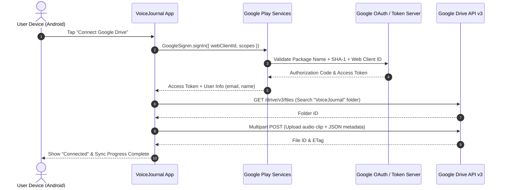

# GCP Setup & Google Drive OAuth Configuration Plan

> **Document Version:** 1.0.0  
> **Date:** 2026-09-19  
> **Status:** Draft  
> **Related Architecture:** [2026-09-19_voice-journal-app-plan.md](file:///home/eric/repos/voice-journal-app/docs/plans/2026-09-19_voice-journal-app-plan.md)  
> **Scope:** Google Cloud Platform (GCP) Console, OAuth 2.0 Credentials, Google Drive API v3, EAS Keystore Integration

---

## 1. Executive Summary

VoiceJournal integrates with Google Drive via `@react-native-google-signin/google-signin` and the Google Drive REST API v3 to provide offline-first cloud backup and synchronization of journal entries and audio files.

To allow Android devices to sign in with Google Play Services and exchange tokens for Drive API requests, the application requires:
1. A Google Cloud Platform (GCP) project with the **Google Drive API** enabled.
2. An **OAuth Consent Screen** configured with the minimal, non-sensitive scope `https://www.googleapis.com/auth/drive.file`.
3. A **Web Application OAuth 2.0 Client ID** passed as the server audience parameter (`EXPO_PUBLIC_GOOGLE_WEB_CLIENT_ID`).
4. An **Android OAuth 2.0 Client ID** linked to package `com.personal.voicejournal` and authorized by the signing certificate SHA-1 fingerprint.

---

## 2. Architecture & Authentication Flow



---

## 3. Prerequisites

- A standard Google account (e.g., `ericvan76@gmail.com`).
- Access to [Google Cloud Console](https://console.cloud.google.com/).
- EAS CLI installed and authenticated (`npx eas whoami`).
- GitHub repository with locked `main` branch (merges via Pull Requests).

---

## 4. Step-by-Step Implementation Guide

### Step 1: Create or Select GCP Project

1. Navigate to [Google Cloud Console](https://console.cloud.google.com/).
2. Click the project dropdown in the top header navigation bar and click **New Project**.
3. Configure the project:
   - **Project Name:** `voice-journal-app`
   - **Organization:** *No organization* (or select your personal organization if applicable).
4. Click **Create** and ensure the newly created project is selected in the top bar.

---

### Step 2: Enable Google Drive API

1. In the left navigation menu, go to **APIs & Services** &rarr; **Library** (or visit `https://console.cloud.google.com/apis/library`).
2. In the search box, type `Google Drive API`.
3. Select **Google Drive API** from the search results.
4. Click **Enable**.
5. Wait for the API dashboard to confirm activation.

---

### Step 3: Configure OAuth Consent Screen

1. In the left navigation menu, select **APIs & Services** &rarr; **OAuth consent screen** (or `https://console.cloud.google.com/apis/credentials/consent`).
2. **User Type**:
   - Select **External**.
   - Click **Create**.
3. **App Information**:
   - **App name:** `VoiceJournal`
   - **User support email:** Select your Google account email (`ericvan76@gmail.com`).
   - **App logo:** *(Optional)* Leave blank for internal testing.
   - **Application home page / terms:** Leave blank.
   - **Developer contact information:** `ericvan76@gmail.com`.
   - Click **Save and Continue**.
4. **Scopes**:
   - Click **Add or Remove Scopes**.
   - In the filter box, search for `drive.file`.
   - Select the checkbox for:
     - `.../auth/drive.file` &mdash; *See, edit, create, and delete only the specific Google Drive files you use with this app*.
   - > [!IMPORTANT]
   - > **Scope Selection Rationale:** Do **NOT** select `.../auth/drive` or `.../auth/drive.readonly`. The `drive.file` scope grants per-file access solely to files created by VoiceJournal. Because it is non-sensitive, it avoids the requirement for Google Tier-2 security verification (CASA audit), making setup seamless for personal use.
   - Click **Update** &rarr; **Save and Continue**.
5. **Test Users (Testing Mode)**:
   - Click **+ Add Users**.
   - Enter your personal Google email: `ericvan76@gmail.com`.
   - Add any additional Google accounts that will test the app on physical devices.
   - > [!WARNING]
   - > While the publishing status is **Testing**, only explicitly listed test user accounts can authenticate. Any unlisted account will be rejected with an `Access blocked: VoiceJournal has not completed the Google verification process` error.
   - Click **Save and Continue**.
6. **Summary**: Review the settings and click **Back to Dashboard**.

---

### Step 4: Create Web Application OAuth 2.0 Client ID

> [!NOTE]
> Even though VoiceJournal runs as an Android native app, `@react-native-google-signin/google-signin` requires a **Web Application Client ID** passed into `GoogleSignin.configure({ webClientId: '...' })`. Android Play Services uses this server audience parameter to securely issue access tokens with the required `drive.file` scope.

1. Navigate to **APIs & Services** &rarr; **Credentials**.
2. Click **+ Create Credentials** at the top &rarr; select **OAuth client ID**.
3. **Application type**: Select **Web application**.
4. **Name**: `VoiceJournal Web Client`.
5. **Authorized JavaScript origins & Redirect URIs**: Leave empty.
6. Click **Create**.
7. A dialog will appear displaying:
   - **Your Client ID** (e.g., `123456789012-abcdefghijklmnopqrstuvwxyz012345.apps.googleusercontent.com`).
   - **Your Client Secret** (not required by the mobile client).
8. Copy the **Client ID**.
9. Add the Client ID to your local `.env` file:
   ```env
   EXPO_PUBLIC_GOOGLE_WEB_CLIENT_ID=123456789012-abcdefghijklmnopqrstuvwxyz012345.apps.googleusercontent.com
   ```

---

### Step 5: Extract Keystore SHA-1 Certificate Fingerprints

Google Play Services on Android authenticates the calling APK using the combination of its Android Package Name (`com.personal.voicejournal`) and the cryptographic **SHA-1 Fingerprint** of the signing keystore.

#### Option A: EAS Managed Keystore (Cloud & Dev Builds)
1. In your terminal, run:
   ```bash
   npx eas credentials -p android
   ```
2. Select your build profile (e.g., `production` or `development`).
3. Select **Keystore: Manage your keystore**.
4. EAS prints the fingerprint details:
   - Look for **SHA-1 Fingerprint** (e.g., `AA:BB:CC:DD:EE:FF:11:22:33:44:55:66:77:88:99:00:11:22:33:44`).
   - Copy this hexadecimal string.

*(Note: When you run your first `npx eas build -p android --profile development`, EAS automatically generates a managed keystore if one does not exist and prints the SHA-1 in the build summary).*

#### Option B: Local Debug Keystore (Local Run & Emulators)
If running a local development build via `npx expo run:android`:
1. The default debug keystore is located at `~/.android/debug.keystore`.
2. Extract the fingerprint using `keytool`:
   ```bash
   keytool -list -v -keystore ~/.android/debug.keystore -alias androiddebugkey -storepass android -keypass android
   ```
3. Locate the line starting with `SHA1:` and copy the fingerprint.

---

### Step 6: Create Android OAuth 2.0 Client ID

1. Return to [Google Cloud Console Credentials](https://console.cloud.google.com/apis/credentials).
2. Click **+ Create Credentials** &rarr; select **OAuth client ID**.
3. **Application type**: Select **Android**.
4. **Name**: `VoiceJournal Android Client (EAS Production / Dev)`.
5. **Package name**:
   ```
   com.personal.voicejournal
   ```
   *(Must match `expo.android.package` in [app.json](file:///home/eric/repos/voice-journal-app/app.json)).*
6. **SHA-1 certificate fingerprint**:
   - Paste the SHA-1 fingerprint extracted in Step 5 (e.g., `AA:BB:CC:DD:...`).
7. Click **Create**.

> [!TIP]
> If you have multiple signing keys (e.g., a local debug keystore for fast emulator iteration AND an EAS remote keystore for cloud builds), create **two** Android OAuth Client IDs in GCP:
> 1. `VoiceJournal Android (Local Debug)` &rarr; local SHA-1.
> 2. `VoiceJournal Android (EAS Cloud)` &rarr; EAS remote SHA-1.
> Both can share the same package name `com.personal.voicejournal`.

---

## 5. Configuration Reference

### Environment Variables Matrix

| Variable | Description | Location | Public / Secret |
| :--- | :--- | :--- | :--- |
| `EXPO_PUBLIC_GOOGLE_WEB_CLIENT_ID` | OAuth 2.0 Web Client ID from Step 4 | `.env` / EAS Secrets | Public (Embedded in bundle) |
| `EXPO_PUBLIC_GEMINI_API_KEY` | Multimodal Gemini API Key | `.env` / EAS Secrets | Public or in-app Settings |

### In-App Configuration Override
VoiceJournal includes an in-app Settings UI ([SettingsModal.tsx](file:///home/eric/repos/voice-journal-app/src/components/SettingsModal.tsx)) allowing the user to view or override the Web Client ID dynamically without recompiling:
- Tap the **Gear** icon in the timeline header.
- Enter custom **Google Web Client ID**.
- Tap **Save Settings**.
- Tap **Connect Google Drive** to reconfigure `GoogleSignin` immediately.

---

## 6. Verification and Testing Runbook

1. **Verify Environment Setup**:
   - Ensure `.env` contains valid `EXPO_PUBLIC_GOOGLE_WEB_CLIENT_ID`.
2. **Build Dev Client**:
   ```bash
   npx eas build -p android --profile development
   ```
3. **Install on Android Device**:
   - Download the generated `.apk` onto an Android device or emulator with Google Play Services.
4. **Authenticate**:
   - Launch VoiceJournal.
   - Tap **Settings** &rarr; verify Google Client ID is populated.
   - Tap **Connect Google Drive**.
   - Expected behavior:
     - Google Play Services bottom-sheet account picker appears.
     - Select `ericvan76@gmail.com`.
     - Consent dialog appears: "VoiceJournal wants to access your Google Account... See, edit, create, and delete only the specific Google Drive files you use with this app".
     - Tap **Allow**.
     - Settings modal displays `Connected as ericvan76@gmail.com` with a green indicator.
5. **Sync Verification**:
   - Record a test journal entry with microphone audio.
   - Tap **Save**.
   - Observe sync status indicator change to synced.
   - Open [Google Drive Web](https://drive.google.com/) with `ericvan76@gmail.com`.
   - Verify folder `VoiceJournal/` exists and contains the uploaded `.m4a` file and `.json` metadata file.

---

## 7. Troubleshooting Matrix

| Error Code / Symptom | Root Cause | Resolution |
| :--- | :--- | :--- |
| **`DEVELOPER_ERROR` (code 10)** | SHA-1 mismatch or Package Name mismatch in GCP Android Client ID | Verify `app.json` package is `com.personal.voicejournal`. Re-extract SHA-1 from `npx eas credentials` and ensure exact match in GCP Console Android Client ID. |
| **`DEVELOPER_ERROR` (code 10) on configure** | Invalid or missing `webClientId` | Ensure `EXPO_PUBLIC_GOOGLE_WEB_CLIENT_ID` is defined and matches the Web Client ID (type: Web application, NOT Android). |
| **`Access blocked: VoiceJournal has not completed the Google verification process`** | Google account not added to OAuth Consent Screen Test Users | Add the user's Google email under **OAuth consent screen** &rarr; **Test users** in GCP Console. |
| **`SIGN_IN_CANCELLED` (code 13)** | User dismissed the Google sign-in dialog | Normal user action. App should safely ignore and allow retry. |
| **`PLAY_SERVICES_NOT_AVAILABLE`** | Device lacks Google Play Services (e.g. AOSP emulator) | Use an Android Virtual Device (AVD) image that includes **Google Play** or test on a physical Android device. |
| **403 Insufficient Permissions during Drive upload** | Scopes mismatch or user revoked Drive permission | Ensure consent screen includes `drive.file` scope. Call `GoogleSignin.signOut()` and re-authenticate. |

---

## 8. Rollout Checklist

- [ ] GCP Project `voice-journal-app` created.
- [ ] Google Drive API v3 enabled in API Library.
- [ ] OAuth Consent Screen created (User Type: External).
- [ ] Scope `https://www.googleapis.com/auth/drive.file` added.
- [ ] Test user `ericvan76@gmail.com` added under Test Users.
- [ ] Web Application OAuth Client ID generated.
- [ ] Android OAuth Client ID generated with package `com.personal.voicejournal`.
- [ ] SHA-1 fingerprint from EAS Keystore linked to Android OAuth Client ID.
- [ ] `EXPO_PUBLIC_GOOGLE_WEB_CLIENT_ID` added to `.env`.
- [ ] Dev client APK built and tested on Android device.
- [ ] End-to-end drive upload verified.
