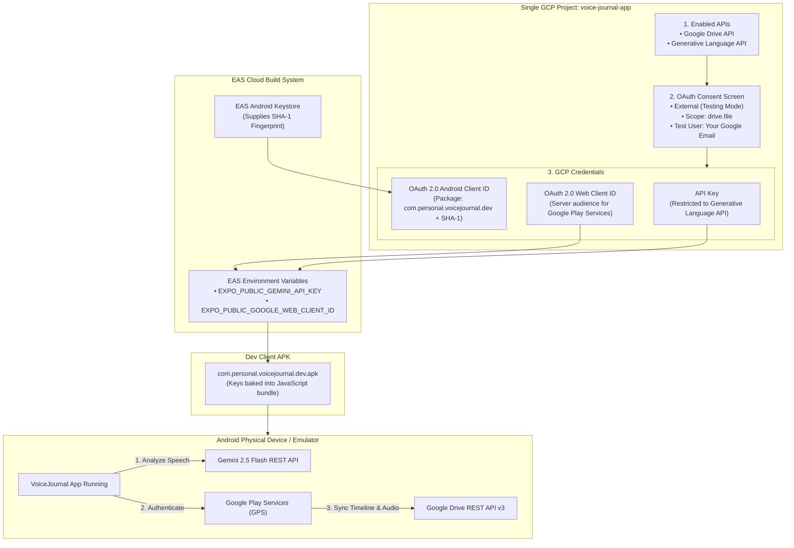

# Complete End-to-End GCP Setup & Dev Client Build Guide

> **Document Version:** 2.0.0  
> **Date:** 2026-09-19  
> **Status:** Active Reference & Runbook  
> **Scope:** Google Cloud Platform (GCP) Console, OAuth 2.0 Credentials, Google Drive API v3, Generative Language API (Gemini 2.5 Flash), EAS Keystore Integration, Dev Client APK Build

---

## 1. Executive Summary

This document is the **single source of truth** for setting up all cloud services and credentials for **VoiceJournal**.

Everything is configured inside **one single Google Cloud Platform (GCP) project** (`voice-journal-app`):
- **Multimodal AI:** Transcribes speech, generates diary headlines, summaries, and tags via the **Generative Language API (Gemini 2.5 Flash)**.
- **Offline-First Sync:** Uploads `.m4a` recordings and SQLite metadata to Google Drive via the **Google Drive API v3**.

All credentials are injected at build time into the **Dev Client APK** via **EAS Environment Variables**. You do **not** need a local `.env` file on your computer, and you do **not** need to use Google AI Studio.

---

## 2. End-to-End Architecture



---

## 3. Prerequisites

| Item | Details |
| :--- | :--- |
| **Google Account** | Personal or workspace Google Account |
| **Google Cloud Console** | [console.cloud.google.com](https://console.cloud.google.com/) |
| **Expo / EAS Account** | Account on [expo.dev](https://expo.dev/) |
| **GitHub Repository** | VoiceJournal GitHub repository |

---

## 4. Step-by-Step Implementation Guide

---

### Step 1: Create the GCP Project

1. Navigate to the [Google Cloud Console](https://console.cloud.google.com/).
2. In the top navigation bar, click the project selector dropdown (next to the Google Cloud logo).
3. In the pop-up modal, click **New Project** in the upper right.
4. Fill in the project details:
   - **Project name:** `voice-journal-app`
   - **Organization:** *No organization* (or select your personal domain if available).
5. Click **Create**.
6. Wait 5–10 seconds for the project to provision, then click the project dropdown in the top bar and select **`voice-journal-app`**.

---

### Step 2: Enable the Two Required Google APIs

Both required APIs must be activated inside the `voice-journal-app` project:

#### 1. Enable Google Drive API
1. In the top search bar, type `Google Drive API` and press Enter.
2. Under **Top results** (or Marketplace), click **Google Drive API**.  
   *(Direct URL: [`https://console.cloud.google.com/apis/library/drive.googleapis.com?project=voice-journal-app`](https://console.cloud.google.com/apis/library/drive.googleapis.com?project=voice-journal-app))*
3. Click the blue **Enable** button.
4. Wait for the API dashboard to confirm activation.

#### 2. Enable Gemini API (Generative Language API)
1. In the top search bar, type `Generative Language API` or `Gemini API`.
2. Under **Top results** (or Marketplace), click the item labeled:  
   👉 **`Gemini API`** *(Marketplace Product • Google • Build with latest models from Google Deepmind...)*.  
   *(Direct URL: [`https://console.cloud.google.com/apis/library/generativelanguage.googleapis.com?project=voice-journal-app`](https://console.cloud.google.com/apis/library/generativelanguage.googleapis.com?project=voice-journal-app))*
3. Click the blue **Enable** button.
4. Wait for the API dashboard to confirm activation (underlying service: `generativelanguage.googleapis.com`).

---

### Step 3: Configure the OAuth Consent Screen

The OAuth Consent Screen defines the permissions VoiceJournal requests from users and who is authorized to log in during development.

1. In the left navigation menu, go to **APIs & Services** &rarr; **OAuth consent screen** (or search `OAuth consent screen`).
2. **User Type**:
   - Select **External**.
   - Click **Create**.
3. **App Information**:
   - **App name:** `VoiceJournal`
   - **User support email:** Select your Google account email from the dropdown.
   - **App logo:** *(Leave empty)*.
   - **App domain:** *(Leave empty)*.
   - **Developer contact information:** Enter your personal or developer email address.
   - Click **Save and Continue**.
4. **Scopes**:
   - Click **Add or Remove Scopes**.
   - In the filter box at the top of the modal, search for `drive.file`.
   - Check the box for:
     - `.../auth/drive.file` &mdash; *See, edit, create, and delete only the specific Google Drive files you use with this app*.
   - > [!IMPORTANT]
   - > **Scope Selection Rationale:** Do **NOT** select `.../auth/drive` (full drive access). The `drive.file` scope only permits VoiceJournal to access files it creates itself. Because it is non-sensitive, it avoids the requirement for Google Tier-2 security verification (CASA audit), making setup seamless for personal use.
   - Click **Update** at the bottom of the modal.
   - Click **Save and Continue**.
5. **Test Users (Crucial)**:
   - Click **+ Add Users**.
   - Enter the Google account email you will use on your test phone/device.
   - Add any additional test Google accounts as needed.
   - > [!WARNING]
   - > While your app publishing status is **Testing**, Google will reject any login attempt from an account not explicitly listed here with an `Access blocked: VoiceJournal has not completed the verification process` error.
   - Click **Add** &rarr; click **Save and Continue**.
6. **Summary**: Review the summary and click **Back to Dashboard**.

---

### Step 4: Create Credential 1 &mdash; Gemini API Key

1. In the left navigation menu, go to **APIs & Services** &rarr; **Credentials**.
2. At the top of the page, click **+ Create Credentials** &rarr; select **API key**.
3. A modal appears displaying your new key (`AIzaSy...`).
4. Click **Edit API key** in the modal (or click the pencil icon next to the key in the list):
   - **Name:** `VoiceJournal Gemini Key`.
   - **API restrictions:** Select **Restrict key**.
   - In the dropdown, check **Generative Language API** only.
   - Click **Save**.
5. Copy the generated key. This will be used as:
   ```
   EXPO_PUBLIC_GEMINI_API_KEY
   ```

---

### Step 5: Create Credential 2 &mdash; Web Application OAuth Client ID

> [!NOTE]
> **Why a Web Client ID for an Android app?**  
> `@react-native-google-signin/google-signin` uses Google Play Services on Android. Google Play Services requires a "server audience" parameter (`webClientId`) to exchange the user's mobile sign-in token for an access token authorized to make Google Drive REST API calls.

1. In **APIs & Services** &rarr; **Credentials**, click **+ Create Credentials** &rarr; select **OAuth client ID**.
2. **Application type:** Select **Web application**.
3. **Name:** `VoiceJournal Web Client`.
4. **Authorized JavaScript origins & Authorized redirect URIs:** Leave empty.
5. Click **Create**.
6. A dialog appears with your **Client ID** (format: `123456789012-xxxxxxxxxxxxxxxxxxxxxxxxxxxxxxxx.apps.googleusercontent.com`).
7. Copy this string. This will be used as:
   ```
   EXPO_PUBLIC_GOOGLE_WEB_CLIENT_ID
   ```

---

### Step 6: Extract Keystore SHA-1 & Create Credential 3 &mdash; Android OAuth Client ID

Google Play Services authenticates the calling Android APK by verifying the combination of its **Package Name** and the **SHA-1 certificate fingerprint** of the signing key.

#### A. Extract your SHA-1 Fingerprint from EAS
Run the following command in your terminal:
```bash
npx eas credentials -p android
```
1. Select the build profile: **`development`** (or `production`).
2. Select **Keystore: Manage your keystore**.
3. Look for the line labeled **SHA-1 Fingerprint** (format: `AA:BB:CC:DD:EE:FF:11:22:33:44:55:66:77:88:99:00:11:22:33:44`).
4. Copy this hexadecimal string.

*(Note: If you have never run a build before, EAS will automatically create a managed keystore during your first build and print the SHA-1 in the build summary).*

#### B. Create the Android OAuth Client ID in GCP
1. Return to [Google Cloud Console Credentials](https://console.cloud.google.com/apis/credentials).
2. Click **+ Create Credentials** &rarr; select **OAuth client ID**.
3. **Application type:** Select **Android**.
4. **Name:** `VoiceJournal Android (Dev Client)`.
5. **Package name:**
   ```
   com.personal.voicejournal.dev
   ```
   *(Note: The Dev Client build workflow appends `.dev` to the package name so it can be installed alongside production).*
6. **SHA-1 certificate fingerprint:** Paste the SHA-1 fingerprint extracted from EAS.
7. Click **Create**.

> [!TIP]
> **For Production Standalone APKs:**  
> Create an additional Android OAuth Client ID with:
> - **Name:** `VoiceJournal Android (Production)`
> - **Package name:** `com.personal.voicejournal`
> - **SHA-1:** Production keystore SHA-1 from EAS.

---

### Step 7: Wire Credentials into EAS (Build Directly into APK)

You do **not** need a local `.env` file on your development machine. Configure these two variables directly in **EAS Environment Variables**, and EAS will automatically inline them into the Dev Client APK bundle during compilation.

#### Option A: Via the Expo Web Dashboard (Recommended)
1. Go to [expo.dev](https://expo.dev/) and sign in to your account.
2. Select the **`voice-journal-app`** project.
3. In the left navigation sidebar, click **Configuration** &rarr; **Environment Variables**.
4. Click **Add Variable**:
   - **Variable name:** `EXPO_PUBLIC_GEMINI_API_KEY`
   - **Value:** Paste your Gemini API key from Step 4 (`AIzaSy...`).
   - **Environment:** Check `Development`, `Preview`, and `Production`.
   - Click **Save**.
5. Click **Add Variable** again:
   - **Variable name:** `EXPO_PUBLIC_GOOGLE_WEB_CLIENT_ID`
   - **Value:** Paste your Web Client ID from Step 5 (`123...apps.googleusercontent.com`).
   - **Environment:** Check `Development`, `Preview`, and `Production`.
   - Click **Save**.

#### Option B: Via Terminal (EAS CLI)
```bash
npx eas env:create --environment development --variable-name EXPO_PUBLIC_GEMINI_API_KEY --value "AIzaSy..." --type string

npx eas env:create --environment development --variable-name EXPO_PUBLIC_GOOGLE_WEB_CLIENT_ID --value "123...apps.googleusercontent.com" --type string
```

---

### Step 8: Set `EXPO_TOKEN` in GitHub Secrets

GitHub Actions needs an Expo Access Token to run `eas build` on your behalf in CI:

1. Go to [expo.dev/settings/access-tokens](https://expo.dev/settings/access-tokens).
2. Click **Create Token**.
3. **Token name:** `voice-journal-github-actions`.
4. Click **Create** and copy the generated token string.
5. In your terminal, save it directly to your GitHub repository secrets:
   ```bash
   gh secret set EXPO_TOKEN
   ```
   *(Paste your token when prompted and press Enter).*
   
   *(Alternatively, configure via GitHub Web: Repository **Settings** &rarr; **Secrets and variables** &rarr; **Actions** &rarr; **New repository secret**).*

---

### Step 9: Trigger the Dev Client APK Build

Once the EAS variables and GitHub secret are in place, trigger the build:

#### Option A: Via GitHub Actions (Cloud)
1. Go to [github.com/ejfn/voice-journal-app/actions](https://github.com/ejfn/voice-journal-app/actions).
2. In the left workflow list, click **Build Dev Client**.
3. Click the **Run workflow** dropdown on the right &rarr; select branch `main` &rarr; click **Run workflow**.
4. When the run finishes, the workflow logs provide the direct download link for the generated `.apk`.

#### Option B: Via EAS CLI Directly
```bash
npx eas build -p android --profile development
```
EAS builds the APK on cloud runners and outputs a download URL and QR code.

---

### Step 10: On-Device Verification Runbook

1. **Install APK**: Download and install the `.apk` on a physical Android phone or Google Play emulator.
2. **Launch VoiceJournal**: Open the app.
3. **Check Status**:
   - Tap the **Gear** icon in the header.
   - Verify that **API KEY STATUS** displays `✓ EXPO_PUBLIC_GEMINI_API_KEY configured (Gemini 2.5 Flash)`.
   - Verify that **CONFIGURATION SOURCE** displays `✓ EXPO_PUBLIC_GOOGLE_WEB_CLIENT_ID configured`.
4. **Test Gemini Multimodal AI**:
   - Close Settings, tap the **Microphone** button, and record a 10-second voice journal entry.
   - Tap **Stop**.
   - Verify that the Review modal displays the verbatim transcript, a generated 3–6 word title, a 1-sentence summary, and clean lowercase tags.
   - Tap **Save Entry**.
5. **Test Google Drive Cloud Sync**:
   - Tap the **Gear** icon &rarr; tap **Sign In with Google**.
   - Select your test Google account.
   - Grant permission on the consent dialog.
   - Confirm status changes to `✓ Connected (<your-email>)`.
   - Tap **Sync Now**.
   - Open [Google Drive Web](https://drive.google.com/) and confirm the entry audio and `.json` file exist in the `VoiceJournal/` folder.

---

## 5. Troubleshooting Matrix

| Error Code / Symptom | Root Cause | Resolution |
| :--- | :--- | :--- |
| **`DEVELOPER_ERROR` (code 10)** | Package Name or SHA-1 mismatch in GCP Android Client ID | Ensure GCP Android Client ID package name is exactly `com.personal.voicejournal.dev` for dev client builds, and the SHA-1 matches `npx eas credentials -p android`. |
| **`DEVELOPER_ERROR` (code 10) on configure** | Invalid or missing `webClientId` | Ensure `EXPO_PUBLIC_GOOGLE_WEB_CLIENT_ID` is set in EAS Environment Variables and matches the **Web application** client ID (NOT the Android client ID). |
| **`Access blocked: VoiceJournal has not completed the Google verification process`** | Google account not added to OAuth Consent Screen Test Users | Add the user's email in GCP Console under **APIs & Services** &rarr; **OAuth consent screen** &rarr; **Test users**. |
| **`400 API_KEY_INVALID` (Gemini)** | Gemini API key mistyped or Generative Language API not enabled | Check that Generative Language API is enabled in GCP and that the key in EAS Environment Variables is copied correctly. |
| **`429 RESOURCE_EXHAUSTED` (Gemini)** | Free-tier rate limit reached (15 RPM) | Implement brief backoff or verify quota in GCP Console. |
| **`PLAY_SERVICES_NOT_AVAILABLE`** | Device lacks Google Play Services (e.g. AOSP emulator) | Use a physical Android device or an AVD image with the Google Play Store icon. |
| **`Invalid UUID appId` in EAS** | Non-UUID `projectId` in `app.json` | Run `npx eas init` to link your EAS project and write the real project UUID into `app.json`. |

---

## 6. Complete End-to-End Checklist

- [ ] GCP Project `voice-journal-app` created.
- [ ] Google Drive API enabled.
- [ ] Generative Language API enabled.
- [ ] OAuth Consent Screen configured (External, User support & developer email set).
- [ ] Scope `https://www.googleapis.com/auth/drive.file` added.
- [ ] Test user Google email added under Test Users.
- [ ] Gemini API Key generated and restricted to Generative Language API.
- [ ] OAuth 2.0 Web Client ID generated (`EXPO_PUBLIC_GOOGLE_WEB_CLIENT_ID`).
- [ ] EAS Android Keystore SHA-1 fingerprint extracted (`npx eas credentials -p android`).
- [ ] OAuth 2.0 Android Client ID created with package `com.personal.voicejournal.dev` and EAS SHA-1.
- [ ] `EXPO_PUBLIC_GEMINI_API_KEY` added to EAS Environment Variables on [expo.dev](https://expo.dev/).
- [ ] `EXPO_PUBLIC_GOOGLE_WEB_CLIENT_ID` added to EAS Environment Variables on [expo.dev](https://expo.dev/).
- [ ] `EXPO_TOKEN` added to GitHub repository secrets (`gh secret set EXPO_TOKEN`).
- [ ] Dev Client APK built via GitHub Actions or EAS CLI.
- [ ] Dev Client installed on Android device and end-to-end AI and Drive sync verified.
