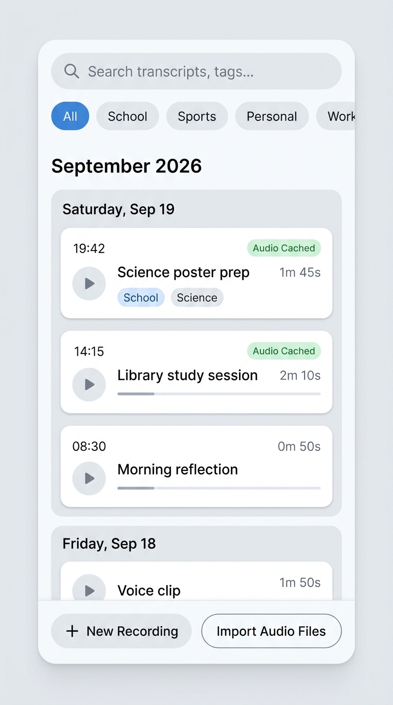
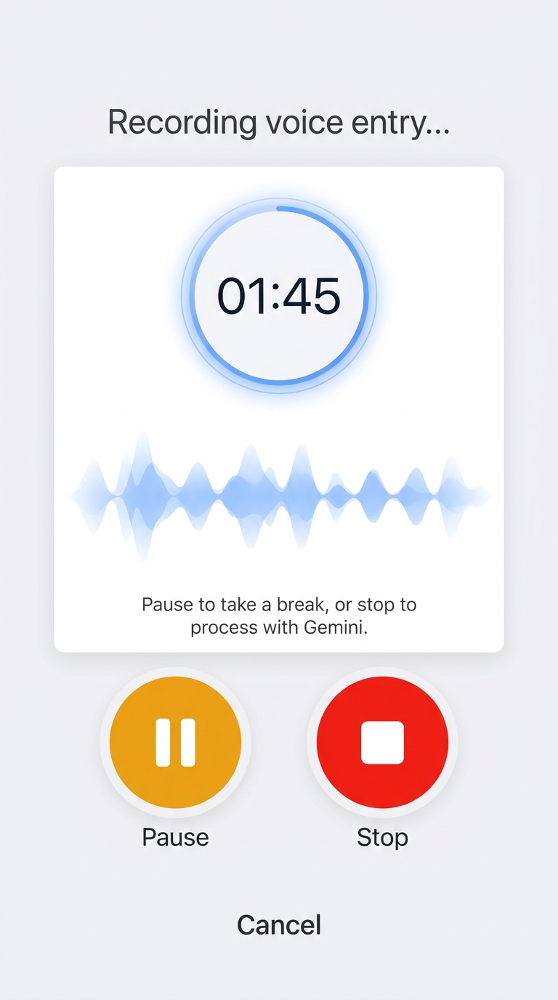
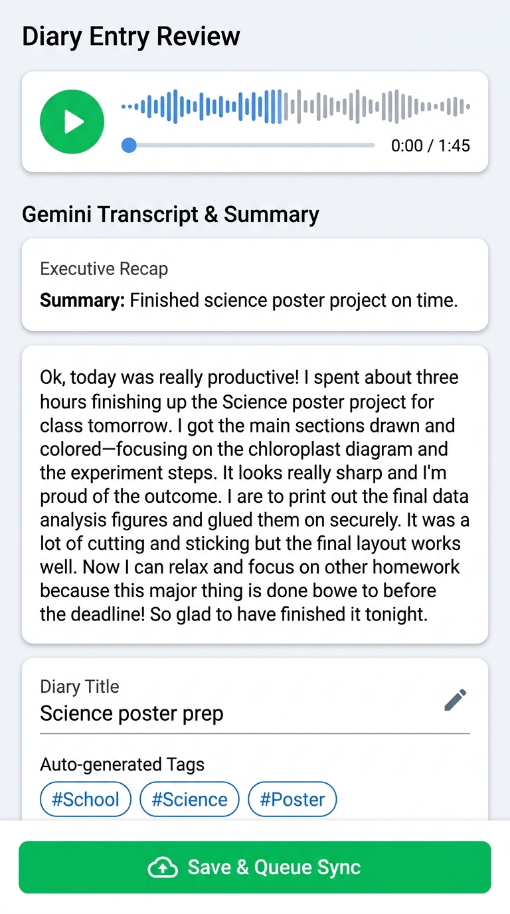

# Voice Journal App: UI & Ergonomics Mockups (Cohesive Light Theme)

This document presents the visual design mockups for the application, featuring a cohesive modern light theme across all core interaction flows.

---

## 1. Multi-Clip Calendar Timeline
- **Search & Tag Filter**: Top search bar with instant FTS5 search, clean filter pills without `#` (`All`, `School`, `Sports`, `Personal`, `Work`).
- **Calendar Month Header**: Clean sticky header `September 2026`.
- **Multi-Clip Day Grouping**: Day header `Saturday, Sep 19` grouping multiple individual voice clips:
  - **19:42**: *Science poster prep* (1m 45s) • `Audio Cached` • tags: `School`, `Science`
  - **14:15**: *Library study session* (2m 10s) • `Audio Cached`
  - **08:30**: *Morning reflection* (0m 50s)
- **Previous Days**: Subsequent date sections (e.g. `Friday, Sep 18`).
- **Quick Action Insets**: Floating bottom buttons (`+ New Recording`, `Import Audio Files`).

---

## 2. Active Recording Modal (Round Hit Targets)
- **Cohesive Light Aesthetic**: Soft light background matching the timeline and review screens.
- **Circular Digital Timer**: Large centered countdown/count-up display (`01:45`).
- **Dynamic Waveform**: Real-time audio metering animation.
- **Accessible Thumb Hit Targets**: Large round circular buttons (`72x72` px) for **Pause / Resume** (amber) and **Stop** (crimson) for effortless one-handed control.
- Sleek `Cancel` link below.

---

## 3. Review & Details Screen (Smooth Scrolling)
- **Audio Scrubber Bar**: Waveform playback scrubber bar with play/pause and timestamp `0:00 / 1:45`.
- **Executive Recap Card**: Dedicated recap container highlighting the 1-sentence AI summary.
- **Verbatim Speech Transcript**: Clean typography with smooth vertical scrolling for lengthy entries.
- **Editable Metadata**: Inline title editor and clean auto-generated tag pills (`School`, `Science`, `Poster` — no `#`).
- **Primary CTA**: Prominent `Save & Queue Sync` button.

