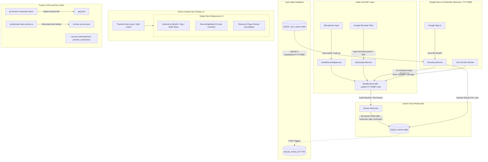

# Implementation Plan: Voice Journal App (DaySpoken)

## Goal Description
Build the `voice-journal-app` (branded as **DaySpoken** / **Voice Journal**) according to the technical specification in [voice-journal-app-complete-spec.pdf](file:///home/eric/Downloads/voice-journal-app-complete-spec.pdf), while adopting the CI/CD, versioning, release automation, and Dev Client architecture from [Tractor](file:///home/eric/repos/Tractor).

The application is an Android-targeted zero-subscription voice diary combining:
1. Native audio capture (pause, resume, stop, audio metering) with prominent circular hit targets, and multi-file SAF audio import (e.g. Google Recorder).
2. Direct audio-to-structured JSON extraction using Gemini Flash multimodal AI (title, transcript, tags without `#` prefix like `School`, `Science`, summary).
3. Local relational database with FTS5 full-text search (`expo-sqlite`).
4. **Multiple Clips Per Day Support**:
   - Each voice note is an independent clip with its own UUID, exact timestamp (`HH:mm`), audio file, transcript, and AI summary.
   - Timeline groups clips by Month (`September 2026`) and Day (`Saturday, Sep 19`), stacking multiple clips recorded on the same day chronologically.
5. **Unified Single-Pane Layout** (No dual-pane complexity):
   - Consistent, clean single-pane layout across all devices (phones, foldables, tablets) with centered max-width content container for wide screens.
6. **Calendar/Month Hierarchical Google Drive Storage** (`DaySpoken/YYYY/MM/`):
   - Files are organized hierarchically by year and month (e.g., `DaySpoken/2026/09/{entry_id}.m4a` and `DaySpoken/2026/09/{entry_id}.json`).
   - Pure file-based sync with no `appProperties` (eliminates 124-byte limits and drift).
7. **Comprehensive Scrolling Ergonomics**:
   - Pull-to-refresh on timeline `SectionList`.
   - Scrollable transcript and summary reader with `ScrollView` and `KeyboardAvoidingView` so long entries and keyboard interactions never clip.
   - Generous bottom content padding so floating action buttons (`+ New Recording`, `Import Audio Files`) never obscure list items.
8. On-demand audio streaming/caching with LRU cache eviction (>500MB / >30 days).
9. Comprehensive Light / Dark theme system with user toggle and default set to system auto.
10. Tractor's exact CI/CD workflows, semantic git version injection (`git-version` action), local dev versioning (`inject-dev-version.js`), and EAS Dev Client configuration.
11. Pure **agy** setup: removal of `CLAUDE.md` and `.claude/` directory in favor of `AGENTS.md`.
12. GitHub repository initialization under user `ejfn` via `gh`.

---

## User Review Required

> [!IMPORTANT]
> **GitHub Repository Creation**: The GitHub repository `ejfn/voice-journal-app` will be created using `gh repo create ejfn/voice-journal-app --public --source=. --remote=origin --push`. If you prefer this repository to be **private**, please let us know.
>
> **EAS Project ID**: EAS workflows require an Expo project ID in `app.json` (`extra.eas.projectId`) and an `EXPO_TOKEN` secret in GitHub repository settings. We will configure placeholders and template scripts aligned with Tractor.
>
> **Gemini API & Google Drive OAuth**: Gemini Flash API key (`EXPO_PUBLIC_GEMINI_API_KEY`) and Google Sign-In web client ID (`EXPO_PUBLIC_GOOGLE_WEB_CLIENT_ID`) will be managed via `.env` and runtime config.

---

## Architecture Overview



---

## Multi-Clip Per Day Design

When a user records multiple times in a day (e.g. morning, afternoon, night):

```
📅 SEPTEMBER 2026
  │
  ├── 🗓️ Saturday, Sep 19
  │     ├── [Clip 1] 19:42 • 1m 45s  "Science poster prep"      (Audio Cached)
  │     │   "Finished presentation poster for science class..."
  │     │   [School] [Science]
  │     │
  │     └── [Clip 2] 09:15 • 0m 45s  "Morning coffee & run"       (Audio Cached)
  │         "Went for a 5k run before breakfast, feeling good..."
  │         [Sports] [Health]
  │
  └── 🗓️ Friday, Sep 18
        └── [Clip 1] 21:00 • 2m 10s  "Evening project reflection" (On Demand)
```

- Each clip maintains its own audio, duration, and Gemini AI summary.
- The UI nests multiple clips seamlessly under the day heading.
- Independent playback: tapping any clip plays that specific recording.

---

## Proposed Changes

### Component 1: Git & GitHub Repository Initialization & Cleanup (Pure agy)

#### [DELETE] `CLAUDE.md` & `.claude/`
Remove Claude-specific configuration files since this repository uses an Antigravity (`agy`) setup with [`AGENTS.md`](file:///home/eric/repos/voice-journal-app/AGENTS.md).

#### [NEW] `.gitignore`
Based on Tractor's `.gitignore` to prevent committing build artifacts, keys, and auto-generated version stamps:
- `node_modules/`, `.expo/`, `dist/`, `web-build/`, `expo-env.d.ts`
- Native keys (`*.jks`, `*.p8`, `*.p12`, `*.key`, `*.mobileprovision`)
- Dev version file: `src/dev-version.json`
- Environment files: `.env`, `.env*.local`
- Logs and coverage: `coverage/`, `logs/*`

#### GitHub Remote Creation
- Commit base files on branch `main`.
- Run `gh repo create ejfn/voice-journal-app --public --source=. --remote=origin --push`.

---

### Component 2: CI/CD, Versioning & EAS Configuration (Tractor Pattern)

#### [NEW] `eas.json`
Matches Tractor's EAS configuration with `developmentClient`, `preview`, and `production` channels:
```json
{
  "cli": {
    "version": ">= 19.0.5",
    "appVersionSource": "remote"
  },
  "build": {
    "development": {
      "developmentClient": true,
      "distribution": "internal",
      "env": {
        "APP_ENV": "development"
      }
    },
    "preview": {
      "distribution": "internal",
      "channel": "preview",
      "android": {
        "buildType": "apk",
        "gradleCommand": ":app:assembleRelease"
      },
      "env": {
        "NODE_ENV": "production"
      }
    },
    "production": {
      "channel": "production",
      "android": {
        "buildType": "apk",
        "gradleCommand": ":app:assembleRelease"
      },
      "env": {
        "NODE_ENV": "production"
      }
    }
  },
  "submit": {
    "production": {}
  }
}
```

#### [NEW] `scripts/inject-dev-version.js`
Exact script from Tractor: queries `git rev-parse HEAD` and latest `v*.*.0` tag, computes `v${baseVersion}-dev`, and writes to `src/dev-version.json`.

#### [NEW] `.github/actions/git-version/action.yml`
Exact composite action from Tractor:
- Calculates `full-version`, `version`, `runtime-version`, and `eas-branch` (`production`, `preview`, or `development`).
- Injects `version`, `runtimeVersion`, and `extra.version` directly into `app.json` via `jq`.

#### [NEW] `.github/workflows/pr-checks.yml`
Runs `npm ci` and `npm run qualitycheck` on PRs targeting `main`.

#### [NEW] `.github/workflows/build-dev-client.yml`
Triggered via `workflow_dispatch`. Injects version, overrides `app.json` name (`DaySpoken (Dev)`) and Android package (`com.personal.voicejournal.dev`), runs `eas build --platform android --profile development --wait`, and extracts build URL.

#### [NEW] `.github/workflows/build-apk.yml`
Triggered on GitHub release (`prereleased`, `released`) or manual dispatch. Runs `qualitycheck`, detects version via `git-version`, triggers `eas build --platform android --profile <branch>`, downloads built APK (`voice-journal-app-<version>.apk`), and uploads it to GitHub Release assets via `softprops/action-gh-release@v2`.

#### [NEW] `.github/workflows/ota-update.yml`
Triggered on push to `main` and manual dispatch. Runs `qualitycheck`, detects version via `git-version`, and publishes update via `eas update --branch ...`.

---

### Component 3: Project Configuration, Dependencies & Theming

#### [MODIFY] `package.json`
Add Tractor-aligned scripts and quality checking:
```json
{
  "name": "voice-journal-app",
  "version": "1.0.0",
  "main": "index.ts",
  "scripts": {
    "start:dev": "node scripts/inject-dev-version.js && expo start --dev-client",
    "start": "node scripts/inject-dev-version.js && expo start",
    "android": "node scripts/inject-dev-version.js && expo start --android",
    "ios": "node scripts/inject-dev-version.js && expo start --ios",
    "lint": "eslint src/ __tests__/",
    "test": "jest",
    "test:silent": "jest --silent",
    "typecheck": "tsc --noEmit",
    "qualitycheck": "npm-run-all typecheck test:silent"
  }
}
```

Dependencies to install:
- Runtime: `expo-audio`, `expo-av`, `expo-file-system`, `expo-sqlite`, `expo-document-picker`, `expo-dev-client`, `expo-updates`, `@react-native-google-signin/google-signin`, `@google/genai`
- Dev: `npm-run-all`, `jest`, `jest-expo`, `@types/jest`, `typescript`, `@types/react`

#### [MODIFY] `app.json`
Configure neutral identifiers, plugins, and automatic theme style:
- `name`: `"DaySpoken"`
- `slug`: `"voice-journal-app"`
- `userInterfaceStyle`: `"automatic"` (allows OS-level light/dark theme switching)
- `android.package`: `"com.personal.voicejournal"`
- `permissions`: `["android.permission.RECORD_AUDIO"]`
- `plugins`: `["expo-audio", "expo-sqlite", "expo-document-picker", "expo-updates"]`
- `runtimeVersion`: `"v1.0.0"`
- `updates.requestHeaders`: `{"expo-channel-name": "production"}`

#### [NEW] `src/theme/ThemeContext.tsx` & `src/theme/colors.ts`
- Theme modes: `'auto' | 'light' | 'dark'`, default set to `'auto'`.
- Subscribes to device color scheme with `useColorScheme()`.
- Design token system: `background`, `surface`, `surfaceAlt`, `text`, `textMuted`, `border`, `primary`, `danger`, `warning`, `success`.

---

### Component 4: Local Database & FTS5 (expo-sqlite)

#### [NEW] `src/db/schema.ts`
Implement SQL DDL migrations as specified in the PRD:
1. `entries` table: `id`, `title`, `summary`, `transcript`, `tags`, `duration_sec`, `source_type`, `local_audio_path`, `drive_audio_file_id`, `drive_sidecar_file_id`, `is_audio_cached`, `created_at`, `last_accessed_at`.
2. `entries_fts` virtual table using FTS5 with `tokenize = 'porter unicode61'`.
3. `sync_queue` table: `id`, `entry_id`, `action`, `status`, `retry_count`, `created_at`.
4. Triggers to keep `entries_fts` automatically in sync with `entries` (INSERT, UPDATE, DELETE).

#### [NEW] `src/db/database.ts`
Database connection manager and migration runner using `expo-sqlite` (new SDK 52+ `openDatabaseSync` / `openDatabaseAsync` API).

#### [NEW] `src/db/dao/entriesDao.ts` & `src/db/dao/syncQueueDao.ts`
- `getEntries({ query, tag, limit, offset })`: Full-text search combining FTS5 match query with tag filtering and pagination.
- `getGroupedTimelineEntries({ query, tag })`: Returns entries grouped by Month and Day to support multiple clips per day.
- `insertEntry(entry)` / `updateEntry(entry)` / `deleteEntry(id)`
- `markAudioAccessed(id)`: Updates `last_accessed_at` for LRU cache tracking.
- `getPrunableCachedEntries()`: Fetches local entries whose audio can be purged if older than 30 days or cache is oversized.

---

### Component 5: Audio Engine & External SAF Import

#### [NEW] `src/services/audio/AudioRecordingService.ts`
- Uses `expo-audio` / `expo-av` with recording state: `IDLE`, `RECORDING`, `PAUSED`, `STOPPED`.
- Provides pause, resume, stop, and real-time metering callback for live waveform rendering.
- Encodes speech to high quality `.m4a` files stored in a calendar hierarchy: `FileSystem.documentDirectory + 'audio/YYYY/MM/{entry_id}.m4a'`.

#### [NEW] `src/services/audio/AudioPlaybackService.ts`
- Audio playback controller supporting pause, play, seek, and playback status events.
- Transparently plays local audio or streams/caches on-demand audio.

#### [NEW] `src/services/audio/AudioImportService.ts`
- Uses `expo-document-picker` with `copyToCacheDirectory: true` and multi-file selection.
- Copies imported Google Recorder audio into local sandboxed calendar storage.
- Reads duration and prepares entry for Gemini processing.

---

### Component 6: Gemini Flash Multimodal AI Contract

#### [NEW] `src/services/ai/GeminiService.ts`
- Implements Google Gen AI client with Gemini Flash model (`gemini-2.5-flash` or `gemini-1.5-flash`).
- Directly inputs audio (base64 encoded or Files API) with structured output JSON schema:
  ```json
  {
    "type": "object",
    "properties": {
      "title": { "type": "string", "description": "Short, natural diary headline (3-6 words)" },
      "transcript": { "type": "string", "description": "Verbatim transcript of speech, cleaned of filler words" },
      "tags": { "type": "array", "items": { "type": "string" }, "description": "Array of 3-5 relevant, thematic tags without hashtags" },
      "summary": { "type": "string", "description": "1-sentence executive summary of the entry" }
    },
    "required": ["title", "transcript", "tags", "summary"]
  }
  ```
- Offline fallback: on network failure, enqueues item into `sync_queue` with action `ANALYZE_AND_UPLOAD`.

---

### Component 7: Google Drive Storage & Calendar/Month Hierarchical Sync

#### [NEW] `src/services/drive/GoogleDriveService.ts`
- Google OAuth2 authentication via `@react-native-google-signin/google-signin` with `https://www.googleapis.com/auth/drive.file`.
- **Calendar/Month Directory Hierarchy in Google Drive**:
  ```
  DaySpoken/
  └── YYYY/          (e.g., 2026)
      └── MM/        (e.g., 09)
          ├── {entry_id}.m4a
          └── {entry_id}.json
  ```
- File Upload:
  - Uploads `{entry_id}.m4a` and `{entry_id}.json` directly into the appropriate month folder.
  - Zero `appProperties` dependencies (pure files).
- Timeline Hydration:
  - Syncs `.json` files across month folders, downloads new/missing JSON files (~2 KB each), and directly populates SQLite `entries` and `entries_fts`.
- Audio On-Demand:
  - Streams/downloads `{entry_id}.m4a` when tapped to local sandbox (`audio/YYYY/MM/{entry_id}.m4a`) and sets `is_audio_cached = 1`.
- LRU Cache Eviction Worker:
  - Checks total audio cache size; if > 500MB or file > 30 days old, unlinks local `.m4a` while preserving SQLite record and setting `is_audio_cached = 0`.

---

### Component 8: Single-Pane Responsive Timeline & Scrolling UI

#### [NEW] `src/components/TimelineHeader.tsx` & `src/components/TagFilterChips.tsx`
- Search bar with instant FTS5 search and theme toggle indicator.
- Filter chips (`All`, `School`, `Sports`, `Imported`, etc.) without `#` prefix.

#### [NEW] `src/components/MonthSectionHeader.tsx`, `src/components/DayGroupHeader.tsx` & `src/components/EntryCard.tsx`
- **Month Section Header**: Clean sticky header (`📅 September 2026`).
- **Day Group Subheader**: Displays date (`Saturday, Sep 19`) grouping that day's clips.
- **Entry Card**: Clip card showing title, exact time of recording (`19:42`), duration (`1m 45s`), summary snippet, tag badges, and audio status badge (`✓ Audio Cached` / `☁ On Demand`).

#### [NEW] `src/components/RecordingModal.tsx`
- Active recording overlay with enhanced ergonomics:
  - Centered circular timer: `01:45`
  - Dynamic audio metering waveform bars (`| | | | | | |`)
  - Status text: "Pause to take a break, or stop to process with Gemini"
  - **Round / Circular Buttons for High Accessibility & Easy Hit**:
    - Large circular Pause / Resume button (`72x72` px, `borderRadius: 36`).
    - Large circular Stop button (`72x72` px, `borderRadius: 36`, red/crimson accent).
    - Centered Cancel text button.

#### [NEW] `src/components/ReviewModal.tsx` / `src/screens/ReviewScreen.tsx`
- **Full Smooth Scrolling**: Wrapped in `ScrollView` with `KeyboardAvoidingView` to easily view very long verbatim transcripts and AI summaries without clipping.
- Audio playback bar: `▶ 0:00 / 1:45 [========----] 🔊`
- Gemini Transcript & Summary display.
- Auto-generated clean tags & editable title.
- Primary CTA: `Save & Queue Sync`.

#### [MODIFY] `App.tsx`
Main application entry:
- Integrates `ThemeProvider` and unified single-pane layout.
- Timeline `SectionList` with pull-to-refresh (`refreshControl`) and extra bottom padding for floating action buttons.

---

## Verification Plan

### Automated Tests
1. **Quality Check Pipeline**:
   ```bash
   npm run qualitycheck
   ```
   Runs `typecheck` (`tsc --noEmit`) and unit tests (`jest --silent`).
2. **Database & FTS5 Unit Tests**:
   - Verify table creation, FTS5 triggers, full-text search indexing, and multi-clip day grouping queries in `__tests__/db.test.ts`.
3. **AI Schema Validation Unit Tests**:
   - Verify Gemini output parsing and clean tag validation (no `#`) in `__tests__/gemini.test.ts`.
4. **Calendar Hierarchy & Path Utilities Unit Tests**:
   - Verify year/month path generators (`audio/2026/09/...`) in `__tests__/path.test.ts`.
5. **CI/CD Workflow Validation**:
   - Validate YAML syntax of all GitHub workflows and composite action `git-version`.

### Manual Verification
1. Verify `scripts/inject-dev-version.js` generates `src/dev-version.json` with commit hash and version.
2. Verify local dev client start command (`npm run start:dev`).
3. Verify light/dark theme switching.
4. Verify recording multiple clips on the same day: each clip displays its exact recording time (`19:42`, `09:15`) under the shared date header (`Saturday, Sep 19`).
5. Verify smooth scrolling on timeline (pull-to-refresh) and review screen.
6. Verify recording modal: round/circular buttons, live metering waveform.
7. Verify Google Drive hierarchical folder creation (`DaySpoken/YYYY/MM/`).
